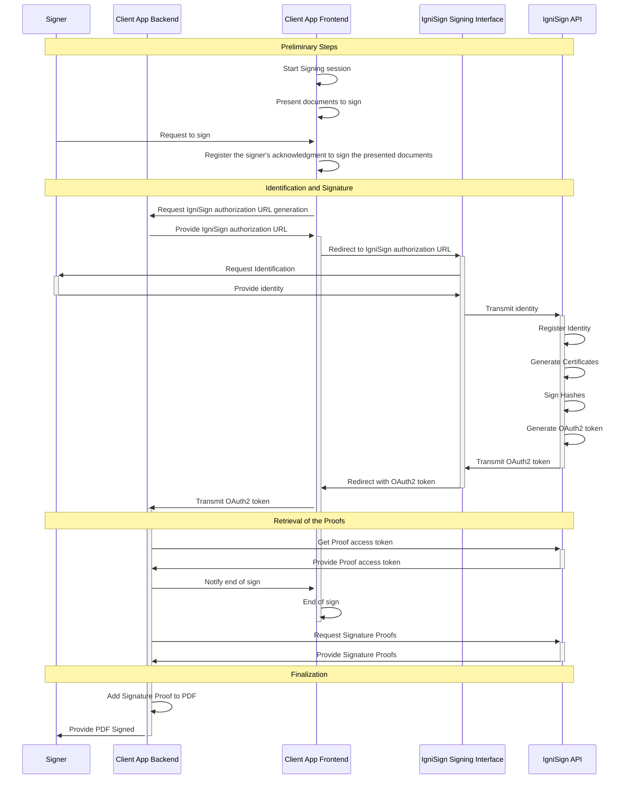

# Bare Signature

The IgniSign Bare Signature is a mechanism that allows documents to be signed using IgniSign within an already implemented signature workflow.


## Flow Summary

Below is the macroscopic sequence diagram of the Bare Signature with IgniSign:




## IgniSign Version and Account Creation

As a first step, you need to create an account on the IgniSign platform that is compatible with the Bare Signature feature.

The Bare Signature feature is available starting from `version 4` of the IgniSign platform.

To create an account with this version, you need to create it on the console v4 of the IgniSign platform. The URL of the console v4 is: [https://console.ignisign.io](https://console.ignisign.io).

If you have an existing account, you can migrate any organization to IgniSign V4 inside the console.

## Configuration on the IgniSign Platform

To use the Bare Signature feature, you need to configure the following elements on the IgniSign platform:

- Create an application of type `Bare Signature` on the IgniSign platform.
- Choose the environment of the application (Development, Staging, Production) that you want to use.
- Configure an API Key for the application in this environment.
- Configure the authorized redirect URIs and allowed origins for the application in the environment.

## SDK and Example

In the following documentation, we will describe two ways to implement the Bare Signature with IgniSign: Directly via API, or using the NodeJS SDK. For showcasing the implementation with the IgniSign NodeJS SDK, we will use example data structures and initialization.

Below are the different elements that we will use to showcase the implementation of the Bare Signature with IgniSign NodeJS SDK:

### Initialization of the IgniSign NodeJS SDK

Before using the IgniSign NodeJS SDK, you need to initialize it:

```javascript
import { IgniSignSdk } from '@ignisign/ignisign-sdk';

try {
  const ignisignSdkInstance = new IgniSignSdk({
    appId,
    appEnv,
    appSecret,
    displayWarning: true,
  });

  await ignisignSdkInstance.init();

} catch (e) {
  console.error("Error when initializing IgniSign Service", e);
}
```

### Example Data Structure

The following is an example of the data structure that we will use to showcase the implementation of the Bare Signature with IgniSign NodeJS SDK.

```javascript
type Example_BareSignatureDocument = {
  fileB64: string;
  fileName: string;
  mimeType: string;
  documentHash: string;
};

enum EXAMPLE_BARE_SIGNATURE_STATUS {
  INIT = 'INIT',
  IN_PROGRESS = 'IN_PROGRESS',
  SIGNED = 'SIGNED',
}

type Example_BareSignature = {
  _id?: string;
  title: string;
  document: Example_BareSignatureDocument;
  status: EXAMPLE_BARE_SIGNATURE_STATUS;
  codeVerifier: string;
  accessToken?: string;
};
```

## Preliminary Steps

The Bare Signature is a mechanism designed to be integrated into a higher-level signature process.

To comply with regulations, it is mandatory to complete the following two steps before starting the signature process with IgniSign:

- Present the documents to be signed to the signer.
- Register the signer's acknowledgment to sign the presented documents.

## Create the Authorization URL

To initiate the signature session, you need to create an authorization URL that will be used to redirect the user to the IgniSign platform for initiating the signature session.

### Create the Authorization URL Manually

- **Base URL**: [https://sign.ignisign.io/envs/:appEnv/oauth2/authorize](https://sign.ignisign.io/envs/:appEnv/oauth2/authorize)

**URL Parameters:**

- **appEnv**: `string`: The environment of the application (DEVELOPMENT | STAGING | PRODUCTION).

**Query Parameters:**

- **client_id**: `string`: The client ID of the application. This is the appId of the associated application in the IgniSign platform.
- **redirect_uri**: `string`: The URL to redirect to after the user authorizes the application. You must configure authorized redirect URIs in the IgniSign platform.
- **response_type**: `string`: The type of response IgniSign should return. Only the `code` value is supported.
- **code_challenge_method**: `string`: The method used to encode the code challenge. Only the `S256` value is supported.
- **code_challenge**: `string`: The code challenge generated by the application (you). Helpers are available in the IgniSign SDK inside the `IgniSignSdkUtilsService` to manage the code challenge mechanism.
- **state**: `string`: The state of the access request.

This is the place where you can specify elements to initialize the signature request.

This object must be a `stringified JSON object` that contains the following elements:

```javascript
{
  // The title of the signature request (Optional - if not provided, a default value will be used)
  title?: "string";

  // Hashes as SHA256 Base64 of the document to sign (Required)
  hashes: string[];

  // Nonce (Required) - a UUID v4 value (can only be used once)
  nonce: "string";

  // externalId (Optional) - a unique identifier of the signature request
  externalId?: "string";

  // Language (Optional) - the language that will be used during the end-user signature process
  // Available options: EN | FR | DE
  language?: "string";
}
```

### Use the SDK to Create the Authorization URL

In the IgniSign SDK, you can use functions to help you create the Authorization URL.

```javascript
import { IgniSignSdkUtilsService, IgniSignSdk } from '@ignisign/sdk';
import * as uuid from "uuid";

const exampleBareSignature: Example_BareSignature = {
  title: "Example Signature",
  externalId: "example-signature-reference-1",
  status: EXAMPLE_BARE_SIGNATURE_STATUS.INIT,
  codeVerifier: "codeVerifier",
  
  document: {
    fileB64: "base64",
    fileName: "example.pdf",
    mimeType: "application/pdf",
    documentHash: "hash_as_sha256_base64",
  },
};

const codeChallenge = IgniSignSdkUtilsService.bareSignature_GenerateCodeChallenge(exampleBareSignature.codeVerifier);

const urlAuthRequestDto: IgnisignBareSignature_GetAuthorizationUrlRequest = {
  externalId: exampleBareSignature._id,
  hashes: [exampleBareSignature.document.documentHash],
  redirectUri: "https://example.com/redirect",
  codeChallenge: codeChallenge,
};

const { authorizationUrl, nonce } = await IgniSignSdkManagerBareSignatureService.getAuthorizationUrl(urlAuthRequestDto);

// Return the authorization URL to your application frontend
```

## Initiate the Signature Session

Once you have received the authorization URL in your frontend application, you need to redirect the signer to this URL to start the signature session.

IgniSign will process the signature session and will redirect the signer to the redirect URI that you provided in the authorization URL.

## Callback Management and Parameters

When IgniSign redirects the signer to the redirect URI, it will provide the following parameters as query parameters:

- **code**: `string`: The code that will be used to get the access token.
- **state**: `string`: The state that was provided to initiate the signature request. You can retrieve the `externalId` of the signature request if you provided it.
- **error**: `string`: The error that occurred during the signature process, if any.

## Retrieve the Proof Access Token

Once you have received the code, you need to retrieve the proof access token to get the proof of the signature.

You can use the API or the IgniSign SDK to retrieve this token.

### Retrieve by API

To retrieve the proof access token via API, you need to make a POST request to the following endpoint:

- **Base URL**: [https://api.ignisign.io/v4/envs/:appEnv/oauth2/proofs-token](https://api.ignisign.io/v4/envs/:appEnv/oauth2/proofs-token)

**URL Parameters:**

- **appEnv**: `string`: The environment of the application (DEVELOPMENT | STAGING | PRODUCTION).

**Body Parameters:**

- **client_id**: `string`: The client ID of the application. This is the appId of the associated application in the IgniSign platform.
- **client_secret**: `string`: The client secret of the application. This is the appSecret of the associated application in the IgniSign platform.
- **code**: `string`: The code that was provided by IgniSign via callback.
- **grant_type**: `string`: The type of grant. Only the `authorization_code` value is supported.
- **redirect_uri**: `string`: The URL to redirect to after the user authorizes the application. You must configure authorized redirect URIs in the IgniSign platform.
- **code_verifier**: `string`: The code verifier that was used to generate the code challenge.

**Response:**

- **access_token**: `string`: The access token that will be used to get the proof of the signature.
- **token_type**: `string`: The type of token. Only the `Bearer` value is supported.
- **expires_in**: `number`: The time in seconds that the token will be valid.
- **scope**: `string`: The scope of the token. Only the `proof_retrieval` value is supported.

### Retrieve Using the IgniSign NodeJs SDK

To retrieve the proof access token using the IgniSign NodeJs SDK, you can use the following function

:

```javascript
import { IgniSignSdk } from '@ignisign/ignisign-sdk';

const myExampleBareSignatureObject = _getMyExampleBareSignatureObject();

const dto: IgnisignBareSignature_SdkProofAccessTokenRequest = {
  code: myExampleBareSignatureObject.code, // The code that was provided by IgniSign via callback
  codeVerifier: myExampleBareSignatureObject.codeVerifier,
  redirectUri: "https://example.com/redirect",
};

const { access_token } = await ignisignSdkInstance.getBareSignatureProofToken(dto);

myExampleBareSignatureObject.accessToken = access_token;

// Save the access token into the signature object
```

## Retrieve the Proof of the Signature

Once you have received the proof access token, you can retrieve the proof of the signature.

You can use the API or the IgniSign SDK to retrieve this proof.

### Retrieve by API

To retrieve the proof of the signature via API, you need to make a GET request to the following endpoint:

- **Base URL**: [https://api.ignisign.io/v4/envs/:appEnv/bare-signatures/proofs](https://api.ignisign.io/v4/envs/:appEnv/bare-signatures/proofs)

**URL Parameters:**

- **appEnv**: `string`: The environment of the application (DEVELOPMENT | STAGING | PRODUCTION).

**Headers:**

- **Authorization**: `string`: The access token provided by IgniSign via callback. It must be prefixed with `Bearer `.

---

This version has been corrected for grammatical accuracy and readability while retaining the original meaning. Let me know if you need any further revisions!

### Retrieve the proof of the signature using the IgniSign NodeJs SDK

To retrieve the proof of the signature using the IgniSign NodeJs SDK, you can use the following function:

```javascript

import { IgnisignSdk } from '@ignisign/ignisign-sdk';

const myExampleBareSignatureObject = _getMyExampleBareSignatureObject();
const proofAccessToken             = myExampleBareSignatureObject.accessToken;

const proof : IgnisignBareSignature_Proof = await ignisignSdkInstance.getBareSignatureProof(proofAccessToken);

// process the proof of the signature.

```

### Bare Signature Proof Data Structure

Below is a description of the data structure of the Bare Signature Proof:

```javascript

class IgnisignBareSignature_Proof {
  // The related appId of the request
  appId              : string;
  
  // The application environment: DEVELOPMENT | STAGING | PRODUCTION
  appEnv             : IGNISIGN_APPLICATION_ENV;

  // A reference of the related signature request that has been processed
  signatureRequestId : string;

  // A reference of the signer that has been created
  signerId           : string;

  // All the proof data related
  proofs             : {

    // A reference of the IgniSign internal document
    documentId          : string;
    // The hash of the document that has been signed
    documentHash        : string;

    // The type of the proofs: the possible values are PKCS7 or CADES
    type                : IGNISIGN_SIGNATURE_PROOF_TYPE;

    // The value of the proof as a Base64 string
    proofB64            : string;

    // The timestamp sequence value of the signature. If the proof is PKCS7, this value will be '-1', because a qualified timestamp is not provided when the signature is PKCS7 based.
    timestampSequence  ?: string;

    // The date of signature
    signingTime        ?: Date;
  }[];
  
  // Information about the signer
  signerInformation : {
    fullName         : string;
    lastName        ?: string;
    firstName       ?: string;
  };

}

```